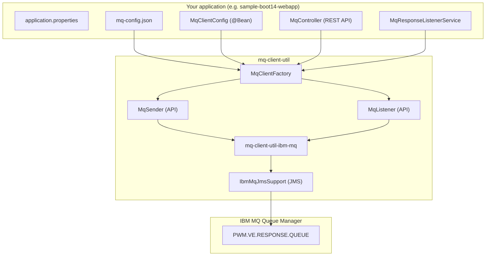
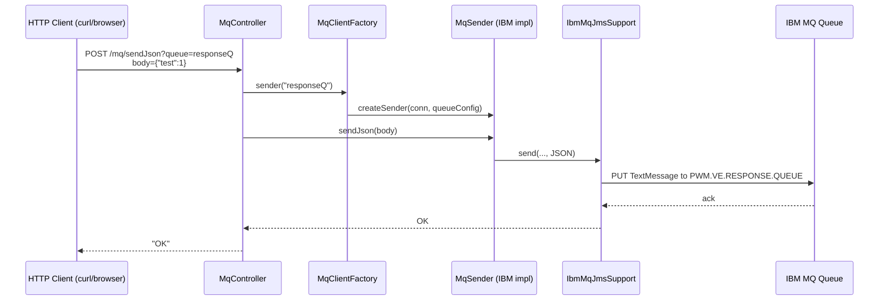
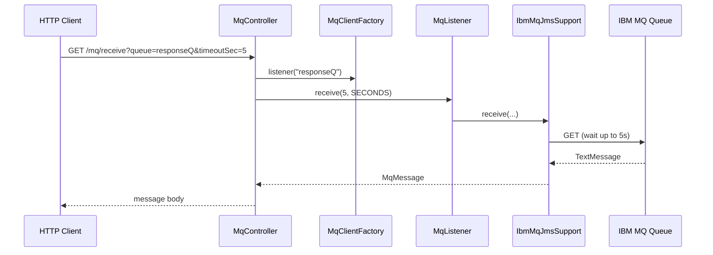
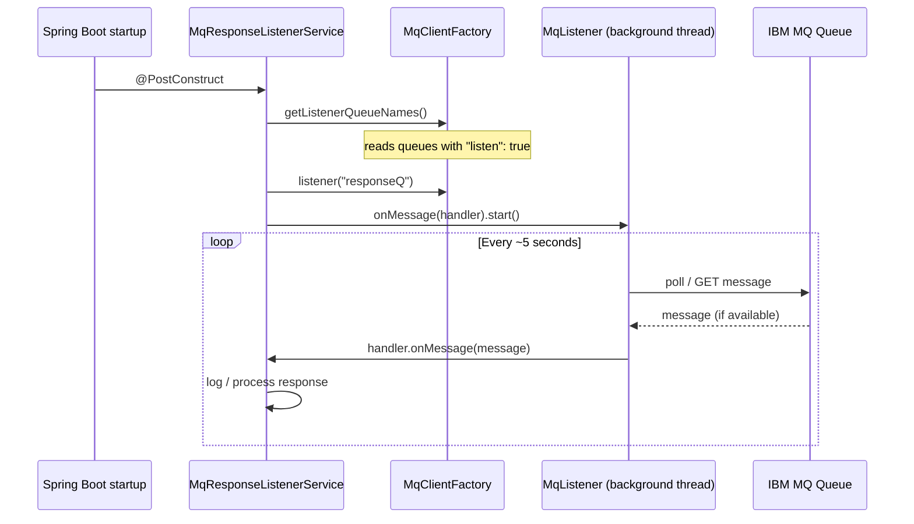
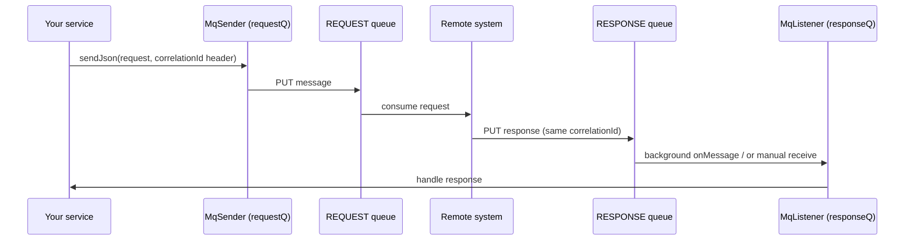

# MQ Client Utility — Library Usage Guide

This document explains how the **mq-client-util** libraries work, how messages flow through the sample Spring Boot application, and how to use the library in your own projects.

---

## 1. What this project provides

A **Java 8**, **Spring-free** MQ client library that:

- Reads connection and queue settings from **`mq-config.json`** (owned by your application)
- Sends messages to IBM MQ as **JSON** or **XML**
- Receives messages from IBM MQ (manual API or background listener)
- Hides IBM MQ JMS details behind a small API

### Maven modules

| Module | Purpose |
|--------|---------|
| `mq-client-util-core` | Config loader, `MqClientFactory`, `MqSender` / `MqListener` API, SPI |
| `mq-client-util-ibm-mq` | IBM MQ JMS implementation (registered via `ServiceLoader`) |
| `sample-boot14-webapp` | Example web app on **Spring Boot 1.4** |
| `sample-boot26-webapp` | Example web app on **Spring Boot 2.6.5** |

Your application depends on:

```xml
<dependency>
  <groupId>com.yourorg.mq</groupId>
  <artifactId>mq-client-util-core</artifactId>
  <version>1.0.1-SNAPSHOT</version>
</dependency>
<dependency>
  <groupId>com.yourorg.mq</groupId>
  <artifactId>mq-client-util-ibm-mq</artifactId>
  <version>1.0.1-SNAPSHOT</version>
</dependency>
```

---

## 2. High-level architecture



**Key idea:** Your app owns `mq-config.json`. The library never ships with it. You create one `MqClientFactory` and ask it for senders/listeners by **logical queue name**.

---

## 3. Configuration — `mq-config.json`

Place this file in your app classpath, e.g. `src/main/resources/mq-config.json`.

### Example (local Docker IBM MQ)

```json
{
  "defaultConnection": "ibmVe",
  "connections": {
    "ibmVe": {
      "type": "IBM_MQ",
      "queueManager": "QM.SU000423",
      "channel": "DBTAX.VE.SVRCONN",
      "connectionName": "localhost(1423)",
      "ssl": false,
      "username": "app",
      "password": "passw0rd",
      "useMqCspAuthentication": false
    }
  },
  "queues": {
    "responseQ": {
      "connection": "ibmVe",
      "qname": "PWM.VE.RESPONSE.QUEUE",
      "queueType": "ibm.mq",
      "defaultContentType": "XML",
      "listen": true
    }
  }
}
```

### Connection fields (IBM MQ)

| Field | Description | Example |
|-------|-------------|---------|
| `type` | Provider id | `IBM_MQ` |
| `queueManager` | Queue manager name | `QM.SU000423` |
| `channel` | SVRCONN channel | `DBTAX.VE.SVRCONN` |
| `connectionName` | Host and port as `host(port)` | `localhost(1423)` |
| `ssl` | Use TLS | `true` / `false` |
| `sslCipherSpec` | Cipher when SSL enabled | `ECDHE_RSA_AES_256_GCM_SHA384` |
| `username` / `password` | MQ credentials | `app` / `passw0rd` |
| `useMqCspAuthentication` | Set `false` for compatibility-mode auth on older QMs | `false` |

`connectionName` is parsed into `host` + `port` internally (`localhost` + `1423`).

### Queue fields

| Field | Description | Example |
|-------|-------------|---------|
| `qname` | Physical IBM MQ queue name | `PWM.VE.RESPONSE.QUEUE` |
| `name` | Alternative to `qname` | (optional) |
| `queueType` | Provider hint | `ibm.mq` |
| `defaultContentType` | `JSON` or `XML` | `XML` |
| `replyTo` | Logical name of reply queue (request/reply) | `responseQ` |
| `listen` | Start **background listener** in sample app | `true` |

---

## 4. Core library API (no Spring required)

Package root: `com.db.pwmus.mqclient`

### 4.1 Bootstrap — `MqClientFactory`

```java
import com.db.pwmus.mqclient.core.MqClientFactory;

MqClientFactory factory = MqClientFactory.fromClasspath("mq-config.json");
```

At startup the factory:

1. Parses `mq-config.json`
2. Loads IBM MQ provider via `ServiceLoader` (`META-INF/services/...`)
3. Resolves logical queue names → connection + physical queue

### 4.2 Send messages — `MqSender`

```java
import com.db.pwmus.mqclient.api.MqSender;

MqSender sender = factory.sender("responseQ");

sender.sendJson("{\"orderId\": 123}");
sender.sendXml("<order><id>123</id></order>");

// with headers (e.g. correlationId for request/reply)
Map<String, String> headers = new HashMap<String, String>();
headers.put("correlationId", "corr-001");
sender.sendJson("{\"orderId\": 123}", headers);
```

Internally:

- Body is sent as JMS `TextMessage`
- `contentType` property set to `application/json` or `application/xml`

### 4.3 Receive messages — `MqListener`

**Option A — Manual (blocking) receive**

```java
import com.db.pwmus.mqclient.api.MqListener;
import com.db.pwmus.mqclient.api.MqMessage;

MqListener listener = factory.listener("responseQ");
MqMessage message = listener.receive(5, TimeUnit.SECONDS);
if (message != null) {
    String body = message.getBody();
}
```

**Option B — Background listener (poll when message available)**

```java
import com.db.pwmus.mqclient.api.MqMessageHandler;

MqListener listener = factory.listener("responseQ");
listener.onMessage(new MqMessageHandler() {
    @Override
    public void onMessage(MqMessage message) {
        // handle message
    }
});
listener.start();  // background thread polls every ~5 seconds
// ...
listener.stop(); // on shutdown
```

Queues with `"listen": true` in `mq-config.json` are started automatically in the sample Spring Boot app (see section 6).

---

## 5. Message flow diagrams

### 5.1 Send flow (REST → library → IBM MQ)



### 5.2 Manual receive flow (REST poll)



### 5.3 Background listener flow (automatic, no curl)



### 5.4 Request / response pattern (typical integration)

For a full request/reply scenario you usually define **two** logical queues:

```json
"queues": {
  "requestQ": {
    "connection": "ibmVe",
    "qname": "PWM.VE.REQUEST.QUEUE",
    "defaultContentType": "JSON",
    "replyTo": "responseQ"
  },
  "responseQ": {
    "connection": "ibmVe",
    "qname": "PWM.VE.RESPONSE.QUEUE",
    "defaultContentType": "XML",
    "listen": true
  }
}
```



---

## 6. How the sample Boot 1.4 app uses the library

### 6.1 Project structure (relevant parts)

```
sample-boot14-webapp/
├── src/main/resources/
│   ├── application.properties      # server.port=8084 only
│   └── mq-config.json              # MQ connections + queues
└── src/main/java/.../sampleboot14/
    ├── SampleBoot14Application.java
    ├── MqClientConfig.java         # Spring @Bean for MqClientFactory
    ├── MqController.java           # REST send/receive APIs
    └── MqResponseListenerService.java  # auto-starts "listen": true queues
```

### 6.2 Spring wiring (thin layer over library)

```java
@Configuration
public class MqClientConfig {
    @Bean(destroyMethod = "close")
    public MqClientFactory mqClientFactory() {
        return MqClientFactory.fromClasspath("mq-config.json");
    }
}
```

The library has **no Spring dependency**. Only the sample app adds this configuration.

### 6.3 REST endpoints (Boot 1.4 and 2.6)

Both `sample-boot14-webapp` (port **8084**) and `sample-boot26-webapp` (port **8086**) expose the same endpoints and include `MqResponseListenerService` for background listening.

| Method | URL | Purpose |
|--------|-----|---------|
| GET | `/mq/sendJson?queue={logical}&body={text}` | Send JSON (body must be URL-encoded) |
| POST | `/mq/sendJson?queue={logical}` + body | Send JSON (recommended) |
| GET | `/mq/receive?queue={logical}&timeoutSec=5` | Manual blocking receive |

**POST example — Boot 1.4 (port 8084):**

```cmd
curl -X POST "http://localhost:8084/mq/sendJson?queue=responseQ" ^
  -H "Content-Type: text/plain" ^
  -d "{\"test\":1}"
```

**POST example — Boot 2.6 (port 8086):**

```cmd
curl -X POST "http://localhost:8086/mq/sendJson?queue=responseQ" ^
  -H "Content-Type: text/plain" ^
  -d "{\"test\":1}"
```

**Manual receive:**

```cmd
curl "http://localhost:8084/mq/receive?queue=responseQ&timeoutSec=5"
```

### 6.4 Background listener

`MqResponseListenerService` runs at startup:

1. Calls `factory.getListenerQueueNames()` → queues with `"listen": true`
2. For each queue: `listener(name).onMessage(handler).start()`
3. Logs every message received

No `application.properties` entry is needed for listener queues — **only `mq-config.json`**.

---

## 7. Inside the IBM MQ module

```
com.db.pwmus.mqclient.ibmmq
├── IbmMqProvider          # SPI entry (type = "IBM_MQ")
├── MqSender               # implements api.MqSender
├── MqListener             # implements api.MqListener (+ background poll)
└── IbmMqJmsSupport        # JMS connection, send, receive
```

Provider registration file:

```
mq-client-util-ibm-mq/src/main/resources/META-INF/services/
  com.db.pwmus.mqclient.spi.MqProvider
```

Content:

```
com.db.pwmus.mqclient.ibmmq.IbmMqProvider
```

When `mq-config.json` has `"type": "IBM_MQ"`, the factory routes to this provider.

---

## 8. Using the library in your own application

### Step 1 — Add dependencies

```xml
<dependency>
  <groupId>com.yourorg.mq</groupId>
  <artifactId>mq-client-util-core</artifactId>
  <version>1.0.1-SNAPSHOT</version>
</dependency>
<dependency>
  <groupId>com.yourorg.mq</groupId>
  <artifactId>mq-client-util-ibm-mq</artifactId>
  <version>1.0.1-SNAPSHOT</version>
</dependency>
```

Also ensure **Jackson** is on the classpath (Spring Boot web starter includes it).

### Step 2 — Add `mq-config.json`

Copy and edit `docker/mq-config.local.json` (local) or use your real QM settings (with SSL if required).

### Step 3 — Create factory (plain Java)

```java
MqClientFactory factory = MqClientFactory.fromClasspath("mq-config.json");

MqSender sender = factory.sender("requestQ");
sender.sendJson(myRequestObject);

MqListener listener = factory.listener("responseQ");
MqMessage response = listener.receive(30, TimeUnit.SECONDS);
```

### Step 4 — Or wire in Spring (Boot 1.4 / 2.6)

```java
@Bean(destroyMethod = "close")
public MqClientFactory mqClientFactory() {
    return MqClientFactory.fromClasspath("mq-config.json");
}

@Autowired
private MqClientFactory mq;

public void send() {
    mq.sender("requestQ").sendJson(payload);
}
```

Copy `MqResponseListenerService` if you want automatic background listening.

---

## 9. Build, run, and test locally

### Prerequisites

- JDK 8 (e.g. Zulu 8)
- Maven 3.x
- Docker Desktop (for local IBM MQ)

### Start local IBM MQ

```cmd
cd d:\project\AI\mq-client-util
docker compose down -v
docker compose up -d
docker\verify-local-mq.bat
```

### Build and run Boot 1.4 sample

```cmd
set JAVA_HOME=C:\Program Files\Zulu\zulu-8
set PATH=%JAVA_HOME%\bin;%PATH%

rebuild-and-run-boot14.bat
```

### Test end-to-end

1. Send:

```cmd
curl -X POST "http://localhost:8084/mq/sendJson?queue=responseQ" -H "Content-Type: text/plain" -d "{\"test\":1}"
```

2. Check app logs for background listener:

```
MQ message received from queue 'responseQ': contentType=application/json, body={"test":1}
```

3. Or use manual API:

```cmd
curl "http://localhost:8084/mq/receive?queue=responseQ&timeoutSec=5"
```

---

## 10. Production vs local config

| Setting | Local Docker (`mq-config.local.json`) | Production |
|---------|----------------------------------------|------------|
| `connectionName` | `localhost(1423)` | Your QM host/port |
| `ssl` | `false` | `true` |
| `sslCipherSpec` | omitted | `ECDHE_RSA_AES_256_GCM_SHA384` |
| `password` | `passw0rd` | From secrets / env |

Use separate config files per environment (e.g. `mq-config-dev.json`, `mq-config-prod.json`) and load the right one at startup.

---

## 11. Troubleshooting

| Symptom | Likely cause | Action |
|---------|--------------|--------|
| `scaffold` / old errors in stack trace | Stale JAR in `.m2` | `mvn clean install -U`, delete `com/yourorg/mq` from `.m2` |
| `2035 MQRC_NOT_AUTHORIZED` | MQ auth / channel | Check user/password, recreate Docker MQ, CHLAUTH |
| `Invalid character in request target` | JSON in GET URL | Use POST or URL-encode body |
| Background listener not starting | `"listen": true` missing | Add to queue in `mq-config.json` |
| Empty receive | No message on queue | Send first; check queue in MQ console |
| `Queue=null` | Old library version | Rebuild `mq-client-util-ibm-mq` |

---

## 12. Quick reference

```java
// 1. Load config (classpath)
MqClientFactory factory = MqClientFactory.fromClasspath("mq-config.json");

// 1b. Load config (external file path)
MqClientFactory factory = MqClientFactory.fromFilePath("D:/config/mq-config.json");
// or from environment:
// MqClientFactory.fromFilePath(System.getenv("MQ_CONFIG_PATH"));

// 2. Send JSON
factory.sender("logicalQueueName").sendJson("{\"a\":1}");

// 3. Send XML
factory.sender("logicalQueueName").sendXml("<a>1</a>");

// 4. Manual receive
MqMessage msg = factory.listener("logicalQueueName").receive(5, TimeUnit.SECONDS);

// 5. Background listen
MqListener l = factory.listener("logicalQueueName");
l.onMessage(msg -> System.out.println(msg.getBody()));
l.start();

// 6. Queues to auto-listen (from config)
List<String> names = factory.getListenerQueueNames(); // "listen": true in JSON
```

---

## 13. Related files

| File | Description |
|------|-------------|
| `init-create-app.md` | Original design and creation strategy |
| `mq-flow.mmd` | Mermaid sequence diagram (send/receive) |
| `docker/mq-config.local.json` | Local IBM MQ config template |
| `docker/mq-config.example.json` | Example with production-like names |
| `rebuild-and-run-boot14.bat` | Build + run sample app on Java 8 |
